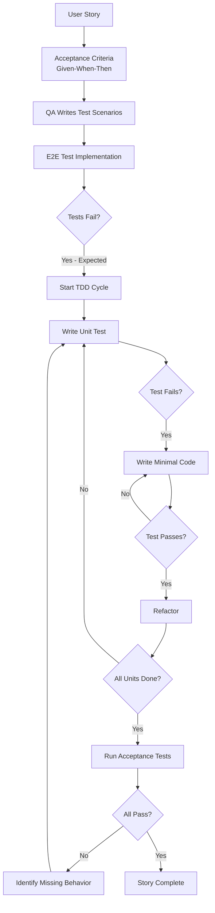

# BDD/TDD Development Workflow Guide
## Behavior-Driven and Test-Driven Development Implementation

---

## Core Principles

### BDD (Behavior-Driven Development)
- **Start with behavior**: Define what the system should do from the user's perspective
- **Write acceptance tests first**: QA creates test scenarios before any code is written
- **Given-When-Then format**: All acceptance criteria must follow this structure
- **Executable specifications**: Tests serve as living documentation

### TDD (Test-Driven Development)
- **Red-Green-Refactor cycle**: Write failing test → Make it pass → Improve code
- **Test smallest units first**: Functions, methods, classes
- **No code without tests**: Every line of production code must have a test
- **Continuous iteration**: Keep cycling until all acceptance tests pass

---

## Development Flow

### Phase 1: Behavior Definition (BDD)

When implementing any feature or story, the workflow MUST start with behavior definition:

1. **Acceptance Criteria Creation**
   - Product owner defines acceptance criteria in Given-When-Then format
   - Each criterion represents a specific behavior the system must exhibit
   - Criteria must be testable and unambiguous

2. **Test Scenario Writing**
   - QA/Test designer writes comprehensive test scenarios BEFORE any code
   - Scenarios cover happy path, edge cases, and error conditions
   - Tests are written but not yet executable (no implementation exists)

3. **Test Implementation**
   - E2E test writer creates executable test code
   - Tests will fail initially (expected - no implementation yet)
   - These failing tests drive the development

### Phase 2: Implementation (TDD)

With behavior tests in place, development follows strict TDD:

1. **Unit Test First**
   ```
   For each function/method to implement:
   a. Write a failing unit test
   b. Write minimal code to pass the test
   c. Refactor while keeping tests green
   d. Repeat until functionality is complete
   ```

2. **Integration Test Layer**
   ```
   For component interactions:
   a. Write failing integration test
   b. Implement interaction code
   c. Verify both unit and integration tests pass
   ```

3. **Acceptance Test Validation**
   ```
   Once units are complete:
   a. Run BDD acceptance tests
   b. If failing, identify missing functionality
   c. Return to unit test cycle
   d. Iterate until all acceptance tests pass
   ```

---

## Workflow Commands

### 1. BDD Story Implementation
```markdown
# .claude/commands/bdd/implement-story.md
---
description: Implement story following strict BDD/TDD practices
---
Story ID: $1

## Step 1: Behavior Definition
First, I'll ensure we have proper acceptance tests defined for story $1.

Query the story details to get acceptance criteria.

Use the qa-test-designer agent to create comprehensive test scenarios from the acceptance criteria. These scenarios should cover:
- Happy path behaviors
- Edge cases and boundary conditions
- Error scenarios and invalid inputs
- Performance requirements

## Step 2: Test Implementation
Now I'll create executable tests BEFORE any implementation.

Use the e2e-test-writer agent to convert test scenarios into executable test code. These tests should:
- Follow Given-When-Then structure
- Be independent and repeatable
- Provide clear failure messages
- Cover all acceptance criteria

Run the tests to confirm they fail (expected since no implementation exists yet).

## Step 3: TDD Implementation
With failing acceptance tests as our guide, start TDD implementation.

Use the task-decomposer agent to identify the smallest testable units needed.

For each unit identified:
1. Use the developer-agent to write a failing unit test
2. Implement minimal code to make the test pass
3. Refactor while keeping all tests green
4. Move to the next unit

Continue this cycle, regularly running the acceptance tests to track progress toward the story goal.

## Step 4: Integration and Validation
Once all units are complete and tested:

Run all unit tests to ensure nothing is broken.

Run integration tests to verify components work together.

Run the acceptance tests - they should now pass.

If any acceptance test fails:
- Identify what behavior is missing
- Return to TDD cycle to implement it
- Repeat until all tests are green

## Step 5: Final Review
Use the code-reviewer-agent to verify:
- All tests are meaningful (not just achieving coverage)
- Code follows SOLID principles
- No untested code paths exist
- Security best practices are followed

Update story status to "done" only when all tests pass.
```

### 2. TDD Function Development
```markdown
# .claude/commands/tdd/create-function.md
---
description: Create a new function using strict TDD approach
---
Function Name: $1
Module: $2
Purpose: $3

## Step 1: Test First
Before writing any production code, I'll create the test.

Create a test file for $2 if it doesn't exist.

Write a failing unit test for function $1 that:
- Tests the expected behavior described in "$3"
- Includes edge cases and error conditions
- Uses clear test names that describe what's being tested
- Provides meaningful assertion messages

Run the test to confirm it fails (function doesn't exist yet).

## Step 2: Minimal Implementation
Now I'll write just enough code to make the test pass.

Create function $1 in module $2 with:
- Minimal implementation to satisfy the test
- No extra features or optimization
- Focus only on making the test green

Run the test again - it should now pass.

## Step 3: Refactor
With a passing test as our safety net, improve the code.

Refactor the implementation to:
- Improve readability
- Follow coding standards
- Optimize if needed
- Add proper error handling

After each change, run the test to ensure it still passes.

## Step 4: Expand Test Coverage
Add additional test cases for:
- Edge cases not yet covered
- Different input combinations
- Error scenarios
- Performance requirements

For each new test:
- Write the failing test first
- Enhance implementation to pass
- Refactor if needed

## Step 5: Documentation
Document the function with:
- Clear description of purpose
- Parameter explanations
- Return value details
- Example usage
- Link to test file

Ensure the documentation matches what the tests verify.
```

### 3. BDD Feature Planning
```markdown
# .claude/commands/bdd/plan-feature.md
---
description: Plan feature with BDD approach - tests before tasks
---
Feature Name: $1
Epic ID: $2

## Step 1: Behavior Specification
I'll start by defining all behaviors this feature must exhibit.

Use the backlog-intake-analyst agent to gather detailed requirements for feature "$1".

Convert requirements into behaviors:
- Each behavior expressed as a user action and expected outcome
- Focus on observable results, not implementation
- Consider all user types and their interactions

## Step 2: Acceptance Test Design
Before any technical planning, define how we'll know the feature works.

Use the qa-test-designer agent to create acceptance tests for each behavior:
- Write scenarios in Given-When-Then format
- Cover success paths and failure modes
- Include performance and security behaviors
- Define clear pass/fail criteria

Store these test scenarios as the feature's acceptance criteria.

## Step 3: Story Breakdown Based on Tests
Now decompose the feature into stories, each with clear test coverage.

Use the scrum-story-generator agent to create stories where:
- Each story maps to specific test scenarios
- Stories are independently testable
- Acceptance criteria directly reference the tests
- No story is considered complete without passing tests

## Step 4: Test-Driven Task Planning
For each story, plan tasks with TDD in mind.

Use the task-decomposer agent to identify:
- What unit tests need to be written
- What integration tests are required
- How acceptance tests will be satisfied
- Dependencies between test layers

Create tasks in this order:
1. Write acceptance tests (BDD)
2. Write unit tests (TDD)
3. Implement code to pass tests
4. Write integration tests
5. Refactor and optimize

## Step 5: Estimation with Test Effort
Estimate stories including test creation time.

Use the story-point-estimator agent considering:
- Time to write comprehensive tests
- Complexity of test scenarios
- TDD iteration cycles needed
- Test maintenance overhead

Store the plan with clear test-first approach documented.
```

### 4. Daily TDD Check
```markdown
# .claude/commands/tdd/daily-check.md
---
description: Verify TDD practices are being followed
---
Sprint: $1

## Step 1: Test Coverage Analysis
I'll analyze test coverage for work in progress.

Query all stories in sprint $1 with status "in_progress".

For each story in progress:
- Check if acceptance tests exist and were written first
- Verify unit test coverage is above threshold (minimum 80%)
- Confirm tests were committed before implementation
- Identify any untested code paths

## Step 2: TDD Compliance Check
Verify the team is following TDD practices.

Review recent commits to check:
- Test files are committed before or with implementation
- No production code without corresponding tests
- Tests follow naming conventions
- Tests are meaningful, not just for coverage

## Step 3: Test Failure Analysis
Identify any issues with the test suite.

Check for:
- Failing tests that need attention
- Flaky tests that pass inconsistently
- Tests that always pass (might not test anything)
- Missing edge case coverage

## Step 4: Generate Compliance Report
Create a TDD compliance summary showing:

**✅ Following TDD:**
- List stories/tasks properly following TDD
- Highlight good test coverage examples

**⚠️ Needs Attention:**
- Code written without tests first
- Low test coverage areas
- Missing acceptance tests

**📊 Metrics:**
- Overall test coverage percentage
- Test-first compliance rate
- Average tests per story
- Test execution time

**🎯 Recommendations:**
- Specific areas needing more tests
- Refactoring opportunities identified by tests
- Test performance improvements needed

Store the report and track trends over time.
```

---

## Agent Specialization for BDD/TDD

### qa-test-designer Agent Enhancement
The qa-test-designer agent should ALWAYS:
1. Create test scenarios BEFORE any implementation
2. Write tests that will initially fail
3. Define clear pass/fail criteria
4. Include performance and security test cases
5. Ensure tests are independent and repeatable

### developer-agent Enhancement
The developer-agent MUST:
1. Never write production code without a failing test
2. Follow Red-Green-Refactor cycle strictly
3. Write minimal code to pass tests
4. Refactor only with passing tests as safety net
5. Ensure every function/method has unit tests

### code-reviewer-agent Enhancement
The code-reviewer-agent should verify:
1. Tests were written before code (check commit history)
2. All production code has corresponding tests
3. Tests actually test behavior, not just achieve coverage
4. No commented-out tests or skip annotations
5. Test names clearly describe what they test

---

## BDD/TDD Workflow Diagram



---

## Metrics and Monitoring

### Key TDD/BDD Metrics to Track

1. **Test-First Compliance**
   - Percentage of commits with tests before code
   - Stories started with acceptance tests
   - Functions created with TDD

2. **Test Coverage Metrics**
   - Line coverage (target: >80%)
   - Branch coverage (target: >75%)
   - Acceptance test coverage (target: 100%)

3. **Test Quality Indicators**
   - Test failure rate (should catch real issues)
   - Test execution time
   - Flaky test count
   - Tests per story ratio

4. **Cycle Time Impact**
   - Time from test creation to passing
   - Refactoring frequency
   - Bugs caught by tests vs production

### SQL Query for TDD Metrics
```sql
-- Track TDD compliance for current sprint
WITH test_metrics AS (
    SELECT 
        s.id as story_id,
        s.title,
        s.sprint_number,
        COUNT(DISTINCT t.id) as total_tasks,
        COUNT(DISTINCT CASE 
            WHEN t.task_type = 'testing' 
            AND t.created_at < MIN(CASE WHEN t.task_type = 'development' THEN t.created_at END)
            THEN t.id 
        END) as test_first_tasks,
        COUNT(DISTINCT CASE 
            WHEN t.task_type = 'testing' 
            THEN t.id 
        END) as test_tasks,
        COUNT(DISTINCT CASE 
            WHEN t.task_type = 'development' 
            THEN t.id 
        END) as dev_tasks
    FROM stories s
    LEFT JOIN tasks t ON t.story_id = s.id
    WHERE s.sprint_number = $1
    GROUP BY s.id, s.title, s.sprint_number
)
SELECT 
    story_id,
    title,
    test_tasks,
    dev_tasks,
    ROUND(100.0 * test_first_tasks / NULLIF(dev_tasks, 0), 2) as tdd_compliance_pct,
    CASE 
        WHEN test_first_tasks = dev_tasks THEN '✅ Full TDD'
        WHEN test_first_tasks > 0 THEN '⚠️ Partial TDD'
        ELSE '❌ No TDD'
    END as tdd_status
FROM test_metrics
ORDER BY tdd_compliance_pct DESC;
```

---

## Common Pitfalls and Solutions

### Pitfall 1: Writing Tests After Code
**Problem**: Developers write code first, then add tests for coverage
**Solution**: 
- Enforce commit hooks that check for test files
- Review commit history in code reviews
- Make test creation a separate, first task

### Pitfall 2: Testing Implementation, Not Behavior
**Problem**: Tests check HOW code works, not WHAT it does
**Solution**:
- Focus tests on public interfaces
- Test outcomes, not internal state
- Use BDD language in test names

### Pitfall 3: Skipping Refactor Step
**Problem**: Once tests pass, code is considered done
**Solution**:
- Make refactoring an explicit task
- Review code quality in addition to test passing
- Track technical debt from skipped refactoring

### Pitfall 4: Incomplete Acceptance Tests
**Problem**: BDD tests don't cover all user scenarios
**Solution**:
- QA reviews acceptance criteria before development
- Include edge cases in initial test design
- Regular test gap analysis

---

## Enforcement Rules

### Mandatory Practices
1. **No story starts without acceptance tests** - QA must write tests first
2. **No function without unit test** - TDD is required for all code
3. **No merge without green tests** - All tests must pass
4. **No deployment with <80% coverage** - Minimum coverage enforced
5. **No sprint close with failing tests** - All tests must be green

### Automated Enforcement
```bash
# Pre-commit hook example
#!/bin/bash
# Check if tests exist for new code files

for file in $(git diff --cached --name-only --diff-filter=A | grep -E '\.(js|ts|py)$'); do
    test_file="${file%.*}.test.${file##*.}"
    if [ ! -f "$test_file" ]; then
        echo "❌ Error: No test file found for $file"
        echo "Please create $test_file first (TDD requirement)"
        exit 1
    fi
done

# Check if tests are committed before or with code
# Implementation details would depend on your specific setup
```

---

## Conclusion

This BDD/TDD workflow ensures:
- **Quality First**: Tests drive development, not the other way around
- **Clear Requirements**: Behavior is defined before implementation
- **Continuous Validation**: Every change is verified by tests
- **Living Documentation**: Tests serve as executable specifications
- **Reduced Bugs**: Issues caught during development, not production

Remember: The goal is not just to have tests, but to let tests guide and improve the development process.