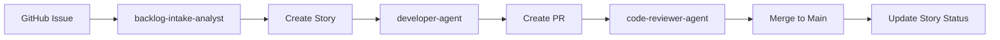
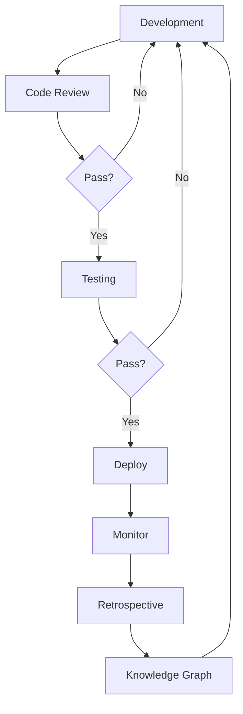

# SDLC Workflow Implementation Guide
## Practical Examples and Command Chains

---

## Quick Start: End-to-End Feature Development

### Example: Implementing User Authentication Feature

#### Step 1: Initialize Product Backlog

Start by creating the main backlog for your quarterly initiatives.

Use the product-owner-planner agent to create a backlog called "Q1 2025 Platform Features" with the vision of modernizing the platform with enhanced security and UX.

The backlog should include:
- Clear vision statement about platform modernization
- Product owner assignment (John Smith in this example)
- High priority rating (9) to indicate strategic importance
- Success metrics for measuring achievement

#### Step 2: Requirements Analysis

Run the command: `/product/analyze-feature "User Authentication"`

This triggers a comprehensive analysis process:

**Requirements Clarification**
The backlog-intake-analyst agent asks important questions:
- Is multi-factor authentication needed?
- Are there SSO requirements for enterprise customers?
- How should sessions be managed across devices?
- What compliance requirements exist (GDPR, SOC2)?

**Business Value Assessment**
The business-analyst agent calculates expected benefits:
- ROI: 40% reduction in password-related support tickets
- User retention: 25% improvement from better security
- Compliance: Meeting enterprise customer requirements
- Competitive advantage: Matching industry standards

**Technical Architecture**
The solution-architect agent designs the approach:
- Token strategy using JWTs for stateless authentication
- OAuth2 integration for social login providers
- Database schema for user accounts and sessions
- Security considerations for password storage and transmission

#### Step 3: Epic and Story Creation

**Creating the Epic**

Create an epic titled "User Authentication System" with clear business value and acceptance criteria.

The epic should include:
- **Business Value**: Enable secure user access with modern authentication methods
- **Success Criteria**:
  - Users can register with email verification
  - Password reset functionality via secure email links
  - Optional multi-factor authentication setup
  - Robust session management across devices
  - OAuth2 provider support (Google, GitHub, etc.)
- **Estimated Effort**: Approximately 89 story points based on complexity

**Generating User Stories**

Use the scrum-story-generator agent to decompose the epic into manageable stories:

1. **User Registration** (5 points)
   - As a user, I want to register with my email
   - So that I can create a secure account

2. **Password Reset** (3 points)
   - As a user, I want to reset my forgotten password
   - So that I can regain access to my account

3. **Two-Factor Authentication** (8 points)
   - As a user, I want to enable 2FA
   - So that my account has additional security

4. **Social Login** (5 points)
   - As a user, I want to login with Google
   - So that I can access the system quickly

5. **Session Management** (8 points)
   - As an admin, I want to manage user sessions
   - So that I can maintain security and compliance

#### Step 4: Sprint Planning

Run the command: `/sprint/auto-plan 1`

**Capacity Calculation**

First, the system analyzes team velocity from the last 3 sprints:
- Historical average: 27 story points per sprint
- Applying 90% buffer for sustainable pace: 24 points target
- This accounts for meetings, code reviews, and unexpected issues

**Story Selection Process**

The sprint-planner agent selects stories based on:
- **Priority Weighting**: Critical items get full weight (1.0), high priority (0.7), medium (0.4)
- **Dependencies**: Ensuring foundational work comes first
- **Team Capacity**: Staying within the 24-point limit
- **Value Delivery**: Maximizing user value in the sprint

**Selected Stories for Sprint 1** (24 points total):

✓ **User Registration** (5 points) - Foundation for all authentication
✓ **Password Reset** (3 points) - Critical for user self-service
✓ **Google OAuth** (5 points) - Quick wins for user convenience
✓ **2FA Setup** (8 points) - Security enhancement
✓ **Login Rate Limiting** (3 points) - Bug fix for security

This selection provides a complete authentication flow while staying within capacity.

#### Step 5: Development Execution

**Processing Each Story**

For each story in the sprint, follow this development workflow:

**Task Breakdown Example - User Registration Story**

Use the task-decomposer agent to identify technical tasks:

1. **Database Design** (2 hours)
   - Design user table schema with proper indexes
   - Consider data privacy and encryption needs

2. **API Development** (4 hours)
   - Create registration endpoint with validation
   - Implement proper error handling
   - Add rate limiting for security

3. **Email Validation** (3 hours)
   - Implement email verification flow
   - Create verification token system
   - Handle edge cases (expired tokens, resends)

4. **Password Security** (2 hours)
   - Add password strength validation
   - Implement secure hashing (bcrypt/argon2)
   - Prevent common weak passwords

5. **Testing** (5 hours total)
   - Write comprehensive unit tests (3 hours)
   - Create integration test scenarios (2 hours)
   - Ensure edge cases are covered

6. **Documentation** (1 hour)
   - Update API documentation
   - Add usage examples
   - Document security considerations

**Development Process**

For each task:
1. Use the developer-agent to guide implementation with secure coding practices
2. Mark task as "in progress" when starting
3. Follow TDD approach - write tests first when applicable
4. Complete implementation following team standards
5. Use code-reviewer-agent to review the code
6. Update task status to "done" with actual hours spent

#### Step 6: Quality Assurance

Run the command: `/qa/validate-story 101`

**Test Planning Phase**

The qa-test-designer agent creates a comprehensive test matrix:

**Unit Tests** (15 test cases):
- Input validation for all fields
- Password strength requirements
- Email format validation
- Token generation and expiration
- Database constraints

**Integration Tests** (8 test cases):
- Registration flow end-to-end
- Email service integration
- Database transaction handling
- Session management
- Error handling scenarios

**E2E Tests** (5 scenarios):
- Happy path: Successful registration
- Duplicate email handling
- Invalid input combinations
- Email verification flow
- Password recovery process

**Test Implementation**

The e2e-test-writer agent creates executable test scenarios following Given-When-Then format:
- **Given**: User is on the registration page
- **When**: Valid credentials are submitted
- **Then**: Account is created and verification email is sent

**Security Validation**

The code-reviewer-agent performs security checks:

✓ **SQL Injection Protection**: All queries use parameterized statements
✓ **Password Security**: Passwords hashed with bcrypt, never stored in plain text
✓ **Input Validation**: All inputs sanitized and validated
✓ **Rate Limiting**: Prevents brute force attacks
✓ **Data Privacy**: GDPR compliance for user data storage and deletion

#### Step 7: Sprint Review

Run the command: `/sprint/review 1`

**Review Process**

The sprint-reviewer agent conducts a comprehensive review:

**Metrics Gathering**
- Retrieve sprint metrics including velocity and burndown data
- Calculate completion percentage
- Identify any incomplete work and reasons

**Sprint 1 Results**

**Completion Summary**:
- **Total Committed**: 24 story points
- **Completed**: 24 story points (100%)
- **Velocity Achieved**: 24 points
- **Stories Delivered**: 5 out of 5

**Quality Metrics**:
- All acceptance criteria verified and met
- 2 bugs discovered during review (both fixed)
- Test coverage above 80% threshold
- No critical security issues found

**Story Status Updates**

For each completed story:
1. Verify all acceptance criteria are met
2. Ensure Definition of Done is satisfied
3. Update status to "done" with completion date
4. Capture any lessons learned or improvements

**Stakeholder Communication**

Prepare a summary for stakeholders highlighting:
- Features now available to users
- Business value delivered
- Any risks or issues to monitor
- Recommendations for next sprint

---

## Workflow Automation Commands

### 1. Full Feature Implementation
```markdown
# .claude/commands/workflow/implement-feature.md
---
description: Complete feature implementation from idea to deployment
---
Feature Name: $1
Business Priority: $2
Target Sprint: $3

## Phase 1: Discovery
I'll start by analyzing the feature requirements for "$1".

Use the backlog-intake-analyst agent to thoroughly analyze "$1" and identify all requirements, dependencies, and acceptance criteria.

Create a new backlog entry with the analyzed requirements.

Store the feature context in memory with all discovered requirements and business goals.

## Phase 2: Planning
Now I'll create the work items structure.

Use the product-owner-planner agent to create an epic for "$1" in the backlog with priority $2.

Use the scrum-story-generator agent to create user stories for the epic with proper Given-When-Then acceptance criteria.

Use the story-point-estimator agent to estimate all stories based on complexity and historical data.

## Phase 3: Sprint Assignment
Planning for sprint $3.

Use the dependency-mapper agent to identify any blockers or dependencies between stories.

Calculate team capacity based on historical velocity.

Assign stories to sprint $3, respecting capacity limits and dependencies.

## Phase 4: Development
Starting the development phase.

Retrieve all stories for the epic.

For each story:
- Use the task-decomposer agent to break down into technical tasks
- Use the developer-agent to implement each task following secure coding practices
- Use the code-reviewer-agent to review the implementation

## Phase 5: Testing
Running comprehensive QA validation.

Use the qa-test-designer agent to create a complete test plan covering unit, integration, and E2E tests.

Use the e2e-test-writer agent to implement the test scenarios.

Run the test suite using Bash tool and verify coverage meets requirements.

## Phase 6: Deployment
Deploying to production environment.

Use the devops-engineer-agent to prepare and execute the deployment.

Monitor metrics and alerts for any issues post-deployment.

## Phase 7: Retrospective
Gathering insights and learnings.

Use the retrospective-facilitator agent to analyze the sprint and gather team feedback.

Store all learnings in the knowledge graph for future reference.
```

### 2. Daily Standup Automation
```markdown
# .claude/commands/daily/standup.md
---
description: Generate daily standup report with blockers and progress
---
Sprint Number: $1

I'll generate a comprehensive daily standup report for sprint $1.

## Gathering Sprint Metrics
First, retrieve the current sprint status for sprint $1 to get completion progress and overall health.

## Finding Blocked Items
Query for blocked items in sprint $1 to identify impediments and their resolution paths.

## Calculating Velocity
Calculate the team's burn rate for sprint $1 to determine if we're on track.

## Generate Standup Report

Create a formatted report showing:

**📊 Daily Standup - Sprint $1**

**📈 Progress:**
- Display completed points vs total points from the metrics
- Show daily burn rate from velocity calculation
- Indicate whether sprint is on track based on metrics

**🚧 Blocked Items:**
For each blocked item found:
- List the item title and blocked reason
- Provide the suggested resolution path
- Identify who can help unblock

**👥 Team Updates:**
For each team member from metrics:
- Show their name and current tasks
- Display points completed today
- Highlight any concerns or achievements

Finally, store today's standup summary in memory for tracking trends over time.
```

### 3. Intelligent Story Estimation
```markdown
# .claude/commands/estimate/smart-estimate.md
---
description: Estimate story points using AI and historical data
---
Story Title: $ARGUMENTS

I'll provide an intelligent estimation for the story: "$ARGUMENTS"

## Finding Similar Stories
Search for similar completed stories with:
- story_title: "$ARGUMENTS"
- similarity_threshold: 0.7 (to find reasonably similar stories)
- estimation_method: "weighted_average" (for balanced estimation)

## Analyzing Complexity Factors
Use the story-point-estimator agent to analyze:
- Technical complexity of the implementation
- Dependencies on other stories or external systems
- Historical accuracy of similar estimations
- Risk factors and unknowns

## Estimation Rationale
Based on the analysis, determine the story point estimate considering:
- Similar stories found and their actual completion times
- Technical complexity assessment
- Team's historical velocity patterns
- Any identified risks or dependencies

## Storing Estimation Context
Store the estimation rationale with:
- The estimated points value
- List of similar stories used as reference
- Confidence level percentage
- Key complexity factors considered

This creates an audit trail for future estimation improvements.

## Updating the Story
If a story ID is available, update it with the estimated points.

Provide a summary showing:
- Recommended estimate: [points]
- Confidence level: [percentage]
- Based on: [number] similar stories
- Key factors: [list main complexity drivers]
```

---

## Integration Patterns

### 1. GitHub Integration Flow


### 2. Continuous Feedback Loop


---

## Best Practices

### 1. Agent Selection Strategy

**Choosing the Right Agent for Each Task**

Match agents to task types based on their specialization:

**Requirements & Analysis**
- Primary: backlog-intake-analyst for clarifying vague requirements
- Support: business-analyst for ROI and value assessment

**Architecture & Design**
- Primary: solution-architect for system design
- Support: technical-lead for technical decisions and standards

**Estimation & Planning**
- Primary: story-point-estimator for data-driven estimates
- Support: velocity-tracker for capacity planning

**Development**
- Primary: developer-agent for secure implementation
- Support: task-decomposer for breaking down work

**Quality & Review**
- Primary: code-reviewer-agent for security and quality
- Support: sprint-reviewer for acceptance validation

**Testing**
- Primary: qa-test-designer for test strategy
- Support: e2e-test-writer for test implementation

**Deployment & Operations**
- Primary: devops-engineer-agent for deployment and monitoring

**Retrospective & Learning**
- Primary: retrospective-facilitator for team insights
- Support: dependency-mapper for blocker analysis

**Context-Based Agent Addition**

Add specialized agents when the context requires:
- If security is critical: Always include code-reviewer-agent
- If performance matters: Add technical-lead for optimization
- If dependencies exist: Include dependency-mapper for analysis

### 2. Memory Management Pattern

**Storing Project Context**

Capture and maintain important project information:

**Project Details to Remember**:
- Technology stack being used (React, Node.js, PostgreSQL, etc.)
- Team size and composition
- Sprint duration (1 week, 2 weeks, etc.)
- Definition of Done criteria
- Architecture decisions and patterns
- Key constraints and requirements

**Team Preferences to Track**:
- Coding style guidelines
- Preferred testing frameworks
- Code review process and requirements
- Estimation methodology (Fibonacci, T-shirt sizes, etc.)
- Communication preferences
- Working hours and availability

**Relationship Mapping**:
- Link team preferences to specific projects
- Connect projects to their sprints
- Associate learnings with features
- Map problems to their solutions

**When to Update Memory**:
- After each sprint retrospective
- When team preferences change
- After solving complex problems
- When new patterns emerge
- After architectural decisions

### 3. Metrics Tracking

**Essential Metrics to Monitor**

**Sprint Health Indicators**:
- Sprint number and dates
- Total stories committed vs completed
- Story points planned vs delivered
- Average cycle time per story
- Number of blocked items
- Completion percentage

**Track these metrics to:
    s.start_date,
    s.end_date,
    COUNT(DISTINCT st.id) as total_stories,
    SUM(CASE WHEN st.status = 'done' THEN st.story_points ELSE 0 END) as completed_points,
    SUM(st.story_points) as committed_points,
    AVG(CASE WHEN st.status = 'done' 
        THEN EXTRACT(EPOCH FROM (st.completed_at - st.created_at))/86400 
        ELSE NULL END) as avg_cycle_time_days,
    COUNT(CASE WHEN st.status = 'blocked' THEN 1 END) as blocked_count,
    ROUND(100.0 * SUM(CASE WHEN st.status = 'done' THEN st.story_points ELSE 0 END) / 
          NULLIF(SUM(st.story_points), 0), 2) as completion_percentage
FROM sprints s
LEFT JOIN stories st ON st.sprint_number = s.sprint_number
GROUP BY s.sprint_number, s.start_date, s.end_date
ORDER BY s.sprint_number DESC;
```

---

## Troubleshooting Guide

### Common Issues and Solutions

1. **Story Estimation Variance**
   - Problem: Estimates differ significantly from actuals
   - Solution: Use `mcp__backlog__estimate_story_points` with more historical data
   - Command: `/recalibrate-estimates --lookback 10`

2. **Sprint Overcommitment**
   - Problem: Team consistently misses sprint goals
   - Solution: Adjust velocity buffer in sprint planning
   - Command: `/sprint/plan $sprint --buffer 0.8`

3. **Blocked Items Accumulation**
   - Problem: Multiple stories blocked for extended periods
   - Solution: Use dependency-mapper to identify root causes
   - Command: `/analyze-blockers --show-critical-path`

4. **Code Review Bottlenecks**
   - Problem: PRs waiting too long for review
   - Solution: Parallelize with multiple reviewer agents
   - Command: `/parallel-review --agents 3`

---

## Performance Optimization

### 1. Batch Operations
```python
# Instead of individual updates
for story in stories:
    mcp__backlog__update_story(story_id: story.id, status: "done")

# Use batch operations
mcp__postgres__execute_dml_ddl_dcl_tcl("""
    UPDATE stories 
    SET status = 'done', completed_at = NOW() 
    WHERE sprint_number = $1 AND status = 'in_review'
""")
```

### 2. Caching Strategy
```python
# Cache frequently accessed data
sprint_cache = mcp__memento__semantic_search(
    query: f"Sprint_{sprint_number}_metrics",
    limit: 1
)

if not sprint_cache or is_stale(sprint_cache):
    metrics = mcp__backlog__get_portfolio_metrics(sprint_number: sprint_number)
    mcp__memento__create_entities([{
        name: f"Sprint_{sprint_number}_metrics",
        type: "cache",
        observations: [json.dumps(metrics)]
    }])
```

### 3. Parallel Agent Execution
```bash
# Run multiple agents concurrently
parallel_tasks = [
    "Use qa-test-designer for test planning",
    "Use developer-agent for implementation",
    "Use technical-lead for architecture review"
]

# Execute in parallel
results = await Promise.all(parallel_tasks)
```

---

## Conclusion

This implementation guide provides practical, actionable workflows for integrating sub-agents, commands, and MCP tools into a cohesive SDLC. The system is designed to be:

- **Modular**: Adopt components incrementally
- **Scalable**: Handle projects of any size
- **Intelligent**: Learn and improve over time
- **Automated**: Reduce manual overhead
- **Traceable**: Full audit trail of all activities

Start with basic commands and gradually build toward full automation as your team becomes comfortable with the workflow.